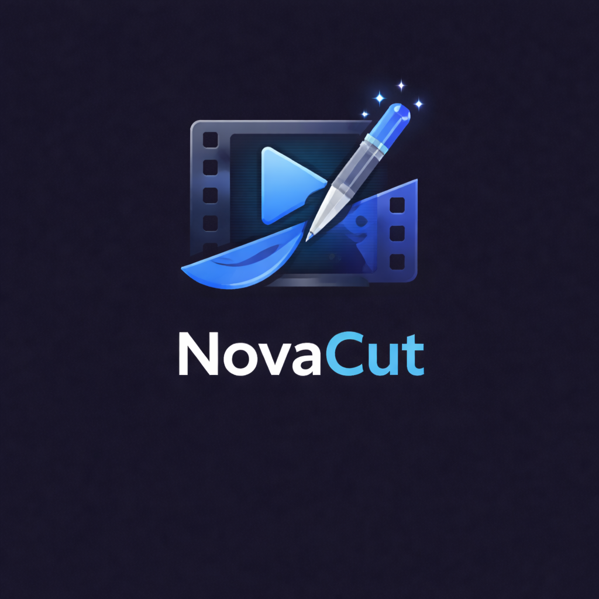

<p align="center"></p>

<p align="center">
  
  
  
</p>

# NovaCut

A professional Android video editor built with Kotlin and Jetpack Compose. Open alternative to CapCut, PowerDirector, and DaVinci Resolve — with on-device AI, GPU-accelerated effects, and desktop NLE interoperability.


<svg width="1800" height="560" viewBox="0 0 1800 560" fill="none" xmlns="http://www.w3.org/2000/svg">
  <defs>
    <linearGradient id="panel" x1="84" y1="66" x2="1718" y2="512" gradientUnits="userSpaceOnUse">
      <stop stop-color="#0A0C12"/>
      <stop offset="0.48" stop-color="#151D2C"/>
      <stop offset="1" stop-color="#1C1622"/>
    </linearGradient>
    <linearGradient id="panelStroke" x1="92" y1="82" x2="1710" y2="504" gradientUnits="userSpaceOnUse">
      <stop stop-color="#F6E0B7" stop-opacity="0.72"/>
      <stop offset="0.45" stop-color="#778096" stop-opacity="0.20"/>
      <stop offset="1" stop-color="#F6E0B7" stop-opacity="0.26"/>
    </linearGradient>
    <linearGradient id="markBorder" x1="156" y1="126" x2="444" y2="414" gradientUnits="userSpaceOnUse">
      <stop stop-color="#F2DAB1" stop-opacity="0.78"/>
      <stop offset="0.55" stop-color="#5B6372" stop-opacity="0.32"/>
      <stop offset="1" stop-color="#BFA06A" stop-opacity="0.62"/>
    </linearGradient>
    <radialGradient id="markGlow" cx="0" cy="0" r="1" gradientUnits="userSpaceOnUse" gradientTransform="translate(300 238) rotate(90) scale(188)">
      <stop stop-color="#D6C6A8" stop-opacity="0.30"/>
      <stop offset="1" stop-color="#D6C6A8" stop-opacity="0"/>
    </radialGradient>
    <linearGradient id="word" x1="542" y1="170" x2="1294" y2="344" gradientUnits="userSpaceOnUse">
      <stop stop-color="#F5F1E8"/>
      <stop offset="0.52" stop-color="#E4D8C2"/>
      <stop offset="1" stop-color="#D2B17B"/>
    </linearGradient>
  </defs>

  <rect x="24" y="30" width="1752" height="500" rx="64" fill="url(#panel)"/>
  <rect x="24.75" y="30.75" width="1750.5" height="498.5" rx="63.25" stroke="url(#panelStroke)" stroke-width="1.5"/>
  <path d="M74 110C214 86 392 86 520 116" stroke="#FFF8EC" stroke-opacity="0.05" stroke-width="2"/>
  <path d="M1252 446C1400 432 1574 436 1716 470" stroke="#FFF8EC" stroke-opacity="0.05" stroke-width="2"/>

  <circle cx="300" cy="256" r="188" fill="url(#markGlow)"/>
  <rect x="116" y="102" width="368" height="368" rx="92" fill="#0E121B"/>
  <rect x="116.75" y="102.75" width="366.5" height="366.5" rx="91.25" stroke="url(#markBorder)" stroke-width="1.5"/>

  <path d="M194 174C194 163.507 202.507 155 213 155H274C284.493 155 293 163.507 293 174V370C293 380.493 284.493 389 274 389H213C202.507 389 194 380.493 194 370V174Z" fill="#F3EEE6"/>
  <path d="M340 174C340 163.507 348.507 155 359 155H420C430.493 155 439 163.507 439 174V370C439 380.493 430.493 389 420 389H359C348.507 389 340 380.493 340 370V174Z" fill="#D1D9E4"/>
  <path d="M300.834 155H361.059C370.14 155 378.202 160.755 381.086 169.368L459.464 403.416C464.16 417.43 453.731 431.738 438.947 431.738H378.799C369.515 431.738 361.322 425.793 358.705 416.883L280.328 182.835C276.114 168.778 286.654 155 300.834 155Z" fill="#D1B07A"/>
  <path d="M333.082 129H366.546C378.417 129 388.367 137.969 389.603 149.775L416.927 410.883C418.462 425.559 406.963 438.477 392.206 438.477H358.743C346.871 438.477 336.922 429.508 335.686 417.702L308.362 156.594C306.826 141.918 318.326 129 333.082 129Z" fill="#E2C393"/>
  <path d="M420 118L433.351 155.649L471 169L433.351 182.351L420 220L406.649 182.351L369 169L406.649 155.649L420 118Z" fill="#F8ECD7"/>

  <path d="M548 112V448" stroke="#F1DEBC" stroke-opacity="0.18" stroke-width="1.5"/>
  <path d="M566 140H1694" stroke="#F1DEBC" stroke-opacity="0.07" stroke-width="1.5"/>

  <text x="618" y="270" fill="url(#word)" font-family="'Georgia', 'Times New Roman', serif" font-size="172" font-weight="700" letter-spacing="-2">NovaCut</text>
  <text x="626" y="340" fill="#A9B0BC" font-family="'Segoe UI', Arial, sans-serif" font-size="38" font-weight="600" letter-spacing="7">PREMIUM MOBILE VIDEO EDITING</text>
  <path d="M626 382H1118" stroke="#D2B17B" stroke-opacity="0.7" stroke-width="3"/>
  <path d="M1142 382H1242" stroke="#EDE3CF" stroke-opacity="0.28" stroke-width="3"/>
</svg>


See [CHANGELOG.md](CHANGELOG.md) for full release history.

## Features

### Timeline Editing
- Multi-track timeline with video, audio, overlay, text, and adjustment layers
- Trim, split, merge, crop, rotate with visual handles
- **Slip/slide editing** — drag clip body to slide (reposition) or slip (shift source window)
- **Magnetic snapping** — clips snap to edges, playhead, and markers (8dp threshold with diamond indicators)
- **Clip grouping** — select multiple clips, group/ungroup, move as a unit
- Speed control (0.1x-16x) with bezier speed ramping curves and presets
- Keyframe animation for position, scale, rotation, opacity, volume with **12 easing types** (linear, ease in/out, spring, bounce, elastic, back, circular, expo, sine, cubic)
- **14 speed presets** including time freeze, film reel, heartbeat, crescendo
- Undo/redo (50 levels) with full state restoration + command-based undo foundation
- Long-press multi-select for batch operations
- Pinch-to-zoom + zoom in/out/fit buttons
- Timeline scrubbing with frame-accurate seeking
- **Colored timeline markers** — 6 colors (red/orange/yellow/green/blue/purple) with labels, notes, and jump navigation
- **Sticker/GIF/image overlays** — position, scale, rotate, opacity with timeline placement
- **Favorites & recent effects** — mark effects as favorites, track recently used for quick access
- **Multi-cam sync** — audio-based clip synchronization across tracks
- **Clip reorder & move** — reorder clips within a track or move between tracks
- **Haptic feedback** — tactile response on trim handle grab and magnetic snap
- **Waveform caching** — LRU cache avoids redundant audio decoding on timeline recomposition
- **Clip color labels** — 7 Catppuccin colors (red, peach, green, blue, mauve, yellow, none) with colored top border on Timeline
- **Track collapse/expand** — Per-track chevron + collapse/expand all toggle, collapsed tracks show thin 24dp colored bars
- **Track height cycling** — Long-press track type icon to cycle 48→64→80→96dp
- **Keyboard shortcuts** — Space, Ctrl+Z/Y, arrow keys, M, S, +/-, Delete, Ctrl+S, Ctrl+C/V for external keyboard editing
- **Snap-to-beat/marker** — Beat markers and timeline markers as additional snap targets (settings-driven)
- **Marker list panel** — Searchable, filterable marker list with color chips, inline label editing, jump-to-time

### Effects & Transitions
- **37 GPU-accelerated GLSL transitions** with unique Material icons per type — dissolve, wipe, zoom, spin, flip, cube, ripple, pixelate, morph, glitch, swirl, heart, dreamy, plus 12 new: door open, burn, radial wipe, mosaic reveal, bounce, lens flare, page curl, cross warp, angular, kaleidoscope, squares wire, color phase
- **40+ video effects** — brightness, contrast, saturation, hue, sharpen, vignette, mosaic, fisheye, wave, chromatic aberration, radial blur, motion blur, tilt shift
- **Film grain** — perceptual-aware (more in shadows, less in highlights), animated blue noise pattern
- **VHS/Retro** — scanlines, chroma bleeding, tracking distortion, posterized color depth
- **Glitch** — RGB channel splitting, 8x8 block corruption, horizontal line displacement
- **Light leak** — procedural animated warm gradient with screen blend mode
- **9-tap Gaussian blur** — separable kernel with proper sigma-based weights
- 18 blend modes (normal, multiply, screen, overlay, soft light, hard light, difference, exclusion, etc.)
- Freehand/rectangle/ellipse/gradient masks with feather, expansion, and motion tracking
- **Professional chroma key** — YCbCr color space keying with smoothstep feathering and green/blue spill suppression

### Color Grading
- Lift/gamma/gain color wheels with continuous control
- RGB curves and HSL qualifier
- **LUT import** (.cube/.3dl) with file picker and intensity control
- **Color matching** — per-channel gamma correction between reference and target clips
- **Video scopes** — histogram, waveform, vectorscope with animated overlay (GPU compute shader ready for ES 3.1+)

### Audio
- Full audio mixer with per-track volume faders, **pan slider**, mute/solo, **smoothed VU meters** (ballistic attack/decay)
- 15 DSP effects — parametric EQ, compressor (corrected attack/release), limiter, delay, chorus, de-esser, pitch shift, noise gate
- Waveform visualization with fade envelope overlay
- **Beat detection** — spectral flux onset detection with adaptive thresholding and BPM estimation (aubio NDK ready)
- **Auto-duck** — speech-aware volume keyframing (analyzes voice track, creates keyframes on music track)
- **EBU R128 loudness normalization** — K-weighted measurement with 6 platform presets:
  - YouTube/Spotify (-14 LUFS), TikTok (-14 LUFS), Podcast/Apple (-16 LUFS), Broadcast EBU R128 (-23 LUFS), Cinema (-24 LUFS), Loud (-9 LUFS)
- True-peak limiting to prevent clipping
- Voiceover recording with automatic timeline placement
- **Fade overlap protection** — fade in + fade out constrained to clip duration
- **Noise reduction** — Spectral gate heuristic (5 modes: off/light/moderate/aggressive/spectral gate). DeepFilterNet ML path planned

### AI Tools
| Tool | Engine | On-Device? |
|------|--------|------------|
| **Auto Captions** | ONNX Runtime Whisper (multilingual, 99 languages) | Yes |
| **Background Removal** | MediaPipe Selfie Segmentation (~1-7MB, ~30fps) | Yes |
| **AI Green Screen** | Planned -- RobustVideoMatting (requires model integration) | Planned |
| **Object Removal** | LaMa-Dilated inpainting (40ms/frame @ 512x512 on flagship devices) | Yes |
| **Video Upscaling** | Planned -- Real-ESRGAN (requires model integration) | Planned |
| **Frame Interpolation** | Planned -- RIFE v4.6 (requires NCNN dependency) | Planned |
| **Style Transfer** | Planned -- AnimeGANv2 + Fast NST (requires model integration) | Planned |
| **Stabilization** | Planned -- OpenCV (requires dependency) | Planned |
| **Smart Reframe** | EMA-smoothed crop trajectory, 3 strategies (face/pose detection is stub) | Partial |
| **Tap-to-Segment** | Planned -- MobileSAM (requires dependency) | Planned |
| **Scene Detection** | Content-aware frame difference analysis with auto-split | Yes |
| **Auto Color** | Histogram-based brightness/contrast/saturation/temperature | Yes |
| **Motion Tracking** | Template matching with position keyframe generation | Yes |
| **Audio Denoise** | Spectral gate heuristic (DeepFilterNet ML planned) | Yes |

### Text & Titles
- Rich text overlays with 10+ animation styles
- **Static templates** — lower thirds, title cards, end screens, CTAs
- **Animated Lottie templates** — 10 built-in (slide-in lower third, bounce title, typewriter, glitch reveal, neon glow, fade subtitle, circle logo reveal, countdown, subscribe button). Render frame-by-frame for export via LottieDrawable
- Caption editor with start/end time sliders (mutually constrained)
- Caption style gallery with karaoke, word-pop, bounce, typewriter, minimal styles
- **Continuous caption positioning** via BiasAlignment (not 3-zone snap)
- Text on path (straight, curved, circular, wave)
- Shadow, glow, letter spacing, line height controls

### Text-to-Speech
- **System TTS** — Android built-in voices with mutex-protected synthesis
- **Piper TTS** (planned) — near-human quality VITS voices via Sherpa-ONNX (stub, requires dependency integration)
  - 10 voice profiles defined: Amy (US), Ryan (US), Alba (UK), Thorsten (DE), Dave (ES), Siwis (FR), Takumi (JP), Huayan (CN), Sunhi (KR), Faber (BR)
  - Currently falls back to Android System TTS
- System/Piper engine toggle in TTS panel

### Export
- **GIF export** — Self-contained GIF89a encoder with LZW compression, configurable frame rate (10/15/20fps) and max width (320/480/640px)
- **Frame capture** — PNG/JPEG single-frame export from current playhead position
- 480p to 4K Ultra HD
- **4 codecs** — H.264, H.265 (HEVC), AV1, VP9 with hardware capability detection via `MediaCodecList`
- **One-tap platform presets** — YouTube 1080p, YouTube 4K, TikTok, Instagram Reels, Instagram Square, Threads
- Batch export with multiple presets simultaneously
- Background export with progress notification, ETA display, and cancel
- **Timeline interchange** — OTIO (OpenTimelineIO) JSON export/import + FCPXML export for desktop NLE round-tripping (DaVinci Resolve, Premiere Pro, Final Cut Pro)
- EDL export (CMX 3600) with sanitized reel names and proper timecodes
- Chapter markers and subtitle export (SRT, VTT with word-level cues, ASS/SSA with full styling)
- **Burned-in subtitle rendering** — Canvas-based with ASS/SSA file generation for FFmpeg integration
- Audio-only and stems export modes
- Export error cleanup — partial output files deleted on failure/timeout

### Effect Library
- Copy/paste effects between clips
- Export effects to `.ncfx` file for sharing
- Import effects from `.ncfx` with portable LUT references (filename-based, not absolute paths)

### Project Management
- User template system (save/load/delete project templates, preserves non-media track clips)
- Project snapshots with version history and auto-generated default names
- Project archive (ZIP export)
- **Auto-save** with configurable interval, format versioning, rotating backups
  - Full serialization: all clip fields, compound clips, 9 caption style properties, mask bezier handles, clip group IDs
- **Command-based undo/redo** foundation — sealed class with AddClip, RemoveClip, TrimClip, MoveClip, SetClipSpeed, ApplyEffect, CompoundCommand
- **3-tier proxy workflow** — thumbnail (scrubbing) / proxy (540p editing) / original (export) with auto-switch and storage management
- Cloud backup UI (backend pending)
- **First-run tutorial** — auto-shows on first launch, dismissable, resettable from Settings

### Settings
- Default resolution, frame rate, aspect ratio, export codec
- Auto-save toggle + interval (15-300s)
- Proxy resolution selector
- Reset first-run tutorial
- **Show waveforms** — Global waveform visibility toggle
- **Snap to beat / snap to markers** — Timeline snap behavior toggles
- **Default track height** — 48/64/80/96dp chips
- **Confirm before delete** — Gate clip deletion dialog
- **Thumbnail cache size** — 64/128/256 MB
- **Default export quality** — LOW/MEDIUM/HIGH
- All settings persist via DataStore

## Tech Stack

| Component | Technology |
|-----------|-----------|
| Language | Kotlin 2.1.0 |
| UI | Jetpack Compose + Material 3 (Catppuccin Mocha theme) |
| Video | Media3 1.9.2 (Transformer + ExoPlayer) |
| Effects | OpenGL ES 3.0 (37 GLSL transitions, 40+ effect shaders) |
| Audio DSP | Custom engine (EQ, compressor, chorus, delay, pitch shift) |
| Speech-to-Text | ONNX Runtime 1.17.0 (Whisper) |
| Noise Reduction | Spectral gate fallback (DeepFilterNet planned) |
| Beat Detection | Spectral flux onset detection (aubio NDK ready) |
| Loudness | EBU R128 / ITU-R BS.1770 measurement |
| Segmentation | MediaPipe Tasks Vision 0.10.14 |
| Video Matting | Planned (RobustVideoMatting, ONNX Runtime) |
| Object Removal | LaMa-Dilated (ONNX Runtime, neighbor-fill fallback) |
| Upscaling | Planned (Real-ESRGAN) |
| Frame Interpolation | Planned (NCNN + Vulkan) |
| Style Transfer | Planned (AnimeGANv2 + Fast NST) |
| Stabilization | Planned (OpenCV) |
| TTS | Android System TTS (Piper via Sherpa-ONNX planned) |
| Animated Titles | Lottie (Airbnb) |
| Timeline Exchange | Planned (OpenTimelineIO) |
| DI | Hilt / Dagger |
| Database | Room (v4 with migration chain 1→4) |
| Settings | DataStore Preferences |
| Architecture | MVVM, single-activity Compose navigation, StateFlow |

## Architecture

```
com.novacut.editor/
├── ai/                     # AI features (captions, scene detect, stabilize, auto-edit)
├── engine/                 # Core engines (29 injectable singletons)
│   ├── VideoEngine          # Media3 playback + export
│   ├── AudioEngine          # Waveform extraction + PCM processing
│   ├── AudioEffectsEngine   # DSP chain (EQ, compressor, chorus, etc.)
│   ├── ShaderEffect         # GLSL fragment shader pipeline
│   ├── KeyframeEngine       # Bezier/hold interpolation
│   ├── ProjectAutoSave      # JSON serialization with format versioning
│   ├── ExportService        # Foreground service for background export
│   ├── BeatDetectionEngine  # Spectral flux onset + BPM estimation
│   ├── LoudnessEngine       # EBU R128 measurement + normalization
│   ├── NoiseReductionEngine # Spectral gate (DeepFilterNet stub)
│   ├── FrameInterpolationEngine  # RIFE v4.6 slow-motion (stub)
│   ├── InpaintingEngine     # LaMa object removal (ONNX Runtime + NNAPI)
│   ├── UpscaleEngine        # Real-ESRGAN video upscaling (stub)
│   ├── VideoMattingEngine   # RVM AI green screen (stub)
│   ├── StabilizationEngine  # OpenCV optical flow (stub)
│   ├── StyleTransferEngine  # AnimeGAN + Fast NST (stub)
│   ├── SmartReframeEngine   # Subject-tracking auto-crop
│   ├── TapSegmentEngine     # MobileSAM tap-to-segment (stub)
│   ├── PiperTtsEngine       # Piper VITS TTS (stub, system TTS fallback)
│   ├── LottieTemplateEngine # Animated title rendering
│   ├── FFmpegEngine         # FFmpegX fallback encoder (stub)
│   ├── SubtitleRenderEngine # Canvas + ASS subtitle rendering
│   ├── CloudInpaintingEngine   # ProPainter cloud API (stub)
│   ├── TimelineExchangeEngine  # OTIO/FCPXML interchange
│   ├── ProxyWorkflowEngine  # 3-tier media management
│   ├── EditCommand          # Command-pattern undo/redo
│   ├── db/ProjectDatabase   # Room database with migrations
│   ├── whisper/WhisperEngine     # Built-in Whisper (ONNX)
│   ├── whisper/SherpaAsrEngine   # Sherpa-ONNX ASR (stub)
│   └── segmentation/        # MediaPipe selfie segmentation
├── model/                  # Data classes (Project, Clip, Track, Effect, etc.)
├── ui/
│   ├── editor/             # Main editor (EditorScreen, EditorViewModel, 40+ panels)
│   ├── export/             # ExportSheet, BatchExportPanel
│   ├── mediapicker/        # MediaPickerSheet
│   ├── projects/           # ProjectListScreen, ProjectTemplateSheet
│   ├── settings/           # SettingsScreen, SettingsViewModel
│   └── theme/              # Catppuccin Mocha theme
├── MainActivity.kt         # Single activity, Compose navigation, permission handling
└── NovaCutApp.kt           # Application class, notification channels
```

## Build

```bash
# Debug build
./gradlew assembleDebug

# Release build (requires keystore.properties or env vars)
./gradlew assembleRelease
```

### Requirements
- Android Studio Ladybug+ (2024.2+)
- AGP 8.7.3, Gradle 8.9, JDK 17
- Android SDK 36

### Release Signing
Configure via `keystore.properties`:
```properties
storeFile=path/to/your.jks
storePassword=yourpass
keyAlias=youralias
keyPassword=yourpass
```

Or via environment variables: `NOVACUT_STORE_FILE`, `NOVACUT_STORE_PASSWORD`, `NOVACUT_KEY_ALIAS`, `NOVACUT_KEY_PASSWORD`

If release credentials are not configured, `assembleRelease` falls back to debug signing so CI and local verification can still produce a testable release artifact without relying on an embedded keystore.

### Dependencies
Key external dependencies currently in `build.gradle.kts`:

| Dependency | Version | Purpose |
|-----------|---------|---------|
| ONNX Runtime | 1.17.0 | Whisper ASR + LaMa inpainting |
| MediaPipe | 0.10.14 | Selfie segmentation |
| Lottie | 6.6.2 | Animated title templates |
| OkHttp | 4.12.0 | Cloud inpainting API |

## Supported Devices

- **Min SDK:** 26 (Android 8.0 Oreo)
- **Target SDK:** 36 (Android 16)
- **Required:** OpenGL ES 3.0
- **Recommended:** 4GB+ RAM, Snapdragon 7-series or better for AI features
- **AV1 hardware encoding:** Pixel 8+, Snapdragon 8 Gen 3+, Dimensity 9200+

## Permissions

| Permission | Purpose |
|------------|---------|
| `READ_MEDIA_VIDEO/AUDIO/IMAGES` | Access media files (API 33+) |
| `READ_EXTERNAL_STORAGE` | Legacy media access (API < 33) |
| `WRITE_EXTERNAL_STORAGE` | Save exports (API < 29) |
| `RECORD_AUDIO` | Voiceover recording |
| `CAMERA` | Video capture from camera |
| `FOREGROUND_SERVICE` | Background export processing |
| `POST_NOTIFICATIONS` | Export progress notifications |
| `INTERNET` | Model downloads (Whisper), cloud inpainting API |
| `VIBRATE` | Haptic feedback |

## Known Limitations
- Blend modes use mid-gray as virtual blend layer (not true dual-texture compositing — requires Media3 Compositor API)
- `clip.isReversed` works in preview but not in export (Media3 Transformer has no reverse playback support)
- Speed curve clips don't correctly affect timeline duration calculation (`Clip.durationMs` uses constant speed only)
- SmartRenderEngine analysis results not used for actual export bypass
- Text overlay strokeWidth not exported (SpannableString has no native stroke support)
- ProjectArchive.importArchive() is export-only (import not fully implemented)
- 11 AI/ML engine stubs awaiting dependency integration (see ROADMAP.md)

## License

MIT
